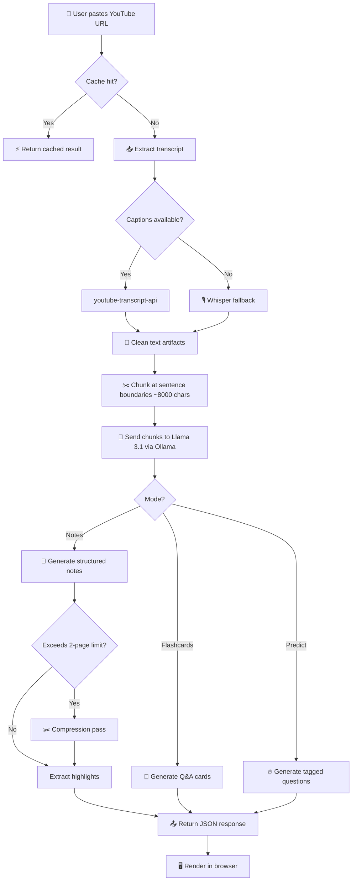

<div align="center">

# 🧠 AI-Copilot

### YouTube → Exam-Ready Study Notes in Seconds

[](https://python.org)
[](https://flask.palletsprojects.com)
[](https://ai.meta.com/llama/)
[](https://ollama.com)
[](LICENSE)

**Paste a YouTube link. Get structured, exam-ready study notes — powered entirely by local AI.**

No sign-up · No cloud · No API keys · Fully offline · Powered by [Llama 3.1](https://ai.meta.com/llama/) via [Ollama](https://ollama.com)

[Features](#-features) · [Quick Start](#-quick-start) · [Usage](#-usage) · [Architecture](#-architecture) · [API Reference](#-api-reference) · [Configuration](#%EF%B8%8F-configuration) · [Contributing](#-contributing)

</div>

---

## 📸 Screenshots

<!-- Add your screenshots here -->
<!--  -->
<!--  -->

---

## ✨ Features

### 🎯 Three AI-Powered Study Modes

| Mode | Description |
|------|-------------|
| 📘 **Exam Notes** | Generates structured, 2-page study notes with definitions, key points, short answers, and predicted exam questions |
| 🧠 **Flashcards** | Creates interactive Q&A flashcards with a 3D CSS flip animation and full keyboard navigation |
| 🔥 **Exam Prediction** | Predicts likely exam questions tagged as `HIGH` or `MEDIUM` probability based on content analysis |

### 🛠️ Smart Features

- **⚡ Must-Memorize Highlights** — Automatically extracts the top 5 most testable facts from generated notes
- **📄 Transcript Preview** — Collapsible raw transcript preview for quick reference
- **📋 Multi-Format Export** — Copy to clipboard, download as `.txt`, or export as `.pdf`
- **🖼️ Video Thumbnail** — Auto-detects and previews the YouTube video thumbnail
- **🔁 Smart Caching** — In-memory cache returns instant results for previously processed URL + mode combos
- **🎙️ Whisper Fallback** — Automatically transcribes audio via OpenAI Whisper when YouTube captions are unavailable
- **📱 Fully Responsive** — Optimized for desktop, tablet, and mobile screens
- **🌙 Dark Mode UI** — Modern dark theme with violet accent for comfortable reading

---

## 🚀 Quick Start

### Prerequisites

| Requirement | Version | Purpose |
|-------------|---------|---------|
| [Python](https://python.org) | 3.9+ | Backend runtime |
| [Ollama](https://ollama.com) | Latest | Local LLM inference server |
| [Llama 3.1](https://ollama.com/library/llama3.1) | — | AI model for note generation |
| [ffmpeg](https://ffmpeg.org) | *(optional)* | Required only for Whisper audio fallback |

### Installation

**1. Clone the repository**

```bash
git clone https://github.com/YashK2511/AI-Notes.git
cd AI-Notes/AI-Copilot
```

**2. Create and activate a virtual environment**

```bash
python3 -m venv venv
source venv/bin/activate        # macOS / Linux
# venv\Scripts\activate          # Windows
```

**3. Install dependencies**

```bash
pip install -r requirements.txt
```

**4. Install & start Ollama**

```bash
# Install Ollama (macOS)
brew install ollama

# Pull the Llama 3.1 model (~4.7 GB)
ollama pull llama3.1

# Start the Ollama server
ollama serve
```

> [!IMPORTANT]
> Ollama must be running on `http://localhost:11434` before starting the app.

**5. Run the app**

```bash
python app.py
```

Open your browser at **http://localhost:5002** 🎉

---

## 🎮 Usage

### Generate Notes

1. Paste any YouTube video URL into the input field
2. Select a mode:
   - **📘 Exam Notes** — structured study notes *(default)*
   - **🧠 Flashcards** — interactive Q&A cards
   - **🔥 Exam Predict** — predicted exam questions with probability tags
3. Click **Generate →** and wait for processing
4. Use the toolbar to **Copy**, **Download TXT**, or **Download PDF**

### Supported YouTube URL Formats

```
https://www.youtube.com/watch?v=VIDEO_ID
https://youtu.be/VIDEO_ID
https://www.youtube.com/shorts/VIDEO_ID
```

### Flashcard Keyboard Controls

| Key | Action |
|-----|--------|
| `Space` | Flip card |
| `→` Arrow Right | Next card |
| `←` Arrow Left | Previous card |
| `Click` on card | Flip card |

---

## 🏗️ Architecture

### System Overview

```
┌─────────────┐     ┌──────────────┐     ┌────────────────┐     ┌──────────────┐     ┌────────────┐
│   Browser    │────▶│  Flask API   │────▶│  Transcript    │────▶│  Processor   │────▶│  Ollama    │
│  (Frontend)  │◀────│  (app.py)    │◀────│  Extraction    │     │  (Clean &    │     │  Llama 3.1 │
│              │     │              │     │                │     │   Chunk)     │     │  (Local)   │
└─────────────┘     └──────────────┘     └────────────────┘     └──────────────┘     └────────────┘
                                          │                │
                                          ▼                ▼
                                   ┌────────────┐  ┌─────────────┐
                                   │  YouTube    │  │   Whisper   │
                                   │  Captions   │  │  (Fallback) │
                                   └────────────┘  └─────────────┘
```

### Processing Pipeline



### How It Works — Step by Step

1. **Transcript Extraction** — Fetches video captions via `youtube-transcript-api`. If captions are disabled, automatically falls back to local Whisper transcription (downloads audio via `yt-dlp`, transcribes with the `base` model).

2. **Text Processing** — Cleans transcript artifacts (`[Music]`, `(inaudible)`, extra whitespace) and splits text into ~8,000-character chunks at sentence boundaries to stay within Ollama's context window.

3. **AI Generation** — Each chunk is sent to Llama 3.1 via Ollama's local API with mode-specific prompt templates. Uses streaming responses with retry logic and exponential backoff.

4. **Post-Processing** — For notes mode: enforces a 2-page limit (~500 words / 3,000 chars) via a compression pass, then extracts the top 5 must-memorize highlights as a JSON array.

5. **Frontend Rendering** — Markdown output is rendered to HTML via `marked.js`. Flashcards use a 3D CSS flip animation. Exam predictions display with color-coded probability badges.

---

## 📁 Project Structure

```
AI-Copilot/
│
├── app.py                   # Flask server — routes, API endpoints, caching
├── ai_engine.py             # Ollama integration — LLM calls with streaming, retry & compression
├── transcript.py            # YouTube transcript extraction + Whisper fallback with LRU cache
├── processor.py             # Text cleaning (artifact removal) & sentence-boundary chunking
├── prompts.py               # All LLM prompt templates (notes, flashcards, predict, compress, highlight)
├── smart_features.py        # Concept frequency analysis for exam prediction
│
├── templates/
│   └── index.html           # Single-page frontend — UI layout + JavaScript logic
│
├── static/
│   └── style.css            # Complete CSS — dark theme, animations, responsive design
│
├── requirements.txt         # Python dependencies
├── .env                     # Environment variables (Ollama URL override)
├── .gitignore               # Git ignore rules
└── README.md                # This file
```

---

## 📡 API Reference

The app exposes a single REST endpoint:

### `POST /generate`

Generate study material from a YouTube video.

**Request Body** (JSON):

```json
{
  "url": "https://www.youtube.com/watch?v=dQw4w9WgXcQ",
  "mode": "notes"
}
```

| Field | Type | Required | Description |
|-------|------|----------|-------------|
| `url` | `string` | ✅ | YouTube video URL |
| `mode` | `string` | ❌ | Generation mode: `"notes"` (default), `"flashcards"`, or `"predict"` |

**Success Response** (`200 OK`):

```json
{
  "notes": "📘 **Topic Title**\n\n**Definition:**\n...",
  "highlights": ["Key fact 1", "Key fact 2", "..."],
  "transcript_preview": "First 500 characters of raw transcript...",
  "chunk_count": 3,
  "error": null
}
```

**Error Responses**:

| Status | Condition |
|--------|-----------|
| `400` | Missing URL, invalid URL format, or no data sent |
| `422` | Transcript extraction failed or video unavailable |
| `500` | Internal server error |

---

## ⚙️ Configuration

### Environment Variables

Create a `.env` file in the project root:

```env
# Override only if Ollama runs on a different machine/port
OLLAMA_URL=http://localhost:11434
```

### AI Engine Tuning

Constants in [`ai_engine.py`](ai_engine.py):

| Constant | Default | Description |
|----------|---------|-------------|
| `MODEL` | `llama3.1` | Ollama model name (can be changed to any Ollama-compatible model) |
| `MAX_NOTES_CHARS` | `3000` | Compression threshold (~500 words / 2 printed pages) |
| `temperature` | `0.3` | Lower = more consistent, deterministic output |
| `num_ctx` | `8192` | Context window size in tokens |
| `retries` | `3` | Max retry attempts with exponential backoff |
| `timeout` | `180s` | Request timeout per Ollama API call |

### Text Processing Tuning

Constants in [`processor.py`](processor.py):

| Constant | Default | Description |
|----------|---------|-------------|
| `max_chars` | `8000` | Chunk size (~2,000 tokens) — fits within Ollama's default context |

---

## 🛠️ Tech Stack

| Layer | Technology | Purpose |
|-------|------------|---------|
| **Backend** | Python 3.9+, Flask | Web server & API |
| **AI Model** | Llama 3.1 via Ollama | Local inference — no cloud, no API keys |
| **Transcript** | youtube-transcript-api | Primary caption extraction |
| **Audio Fallback** | OpenAI Whisper + yt-dlp | Transcription when captions unavailable |
| **Frontend** | HTML5, CSS3, Vanilla JS | Single-page UI |
| **Markdown** | marked.js (CDN) | Client-side markdown → HTML rendering |
| **PDF Export** | jsPDF (CDN) | Client-side PDF generation |
| **Typography** | Inter (Google Fonts) | Modern, clean typeface |
| **Theme** | Dark mode + violet accent (`#7c3aed`) | Premium reading experience |

---

## ⚠️ Troubleshooting

| Issue | Solution |
|-------|----------|
| `Cannot connect to Ollama` | Make sure Ollama is running: `ollama serve` |
| `Llama 3.1 took too long` | Try a shorter video, or increase `timeout` in `ai_engine.py` |
| `This video is private or unavailable` | The video must be public with accessible captions |
| Whisper fallback fails | Install ffmpeg: `brew install ffmpeg` (macOS) or `sudo apt install ffmpeg` (Ubuntu) |
| Notes are too long | Compression runs automatically; adjust `MAX_NOTES_CHARS` in `ai_engine.py` |
| `ModuleNotFoundError` | Make sure your virtual environment is activated: `source venv/bin/activate` |
| Ollama model not found | Pull the model first: `ollama pull llama3.1` |

---

## 🤝 Contributing

Contributions are welcome! Here's how to get started:

1. **Fork** the repository
2. **Create a branch** for your feature:
   ```bash
   git checkout -b feature/amazing-feature
   ```
3. **Commit** your changes:
   ```bash
   git commit -m "feat: add amazing feature"
   ```
4. **Push** to the branch:
   ```bash
   git push origin feature/amazing-feature
   ```
5. **Open a Pull Request**

### Development Tips

- The Flask server runs in **debug mode** with auto-reload — changes to `.py` files restart the server automatically
- Llama 3.1 streaming output is printed to the terminal in real-time for debugging
- The `@lru_cache` on `get_transcript()` caches up to 10 transcripts per session
- The in-memory `_result_cache` in `app.py` stores full results keyed by `(url, mode)`

---

## 🗺️ Roadmap

- [ ] Multi-language transcript support
- [ ] Upload local video/audio files directly
- [ ] Save & organize notes history (SQLite)
- [ ] Support for playlists (batch processing)
- [ ] Custom prompt templates via UI
- [ ] Model selection dropdown (swap between Llama, Mistral, Gemma, etc.)
- [ ] Docker container for one-command deployment

---

## 📜 License

This project is open source and available under the [MIT License](LICENSE).

---

## 🙏 Acknowledgments

- [Meta Llama 3.1](https://ai.meta.com/llama/) — Open-source large language model
- [Ollama](https://ollama.com) — Local model runner and inference engine
- [youtube-transcript-api](https://github.com/jdepoix/youtube-transcript-api) — YouTube transcript fetching
- [OpenAI Whisper](https://github.com/openai/whisper) — Speech-to-text fallback
- [marked.js](https://marked.js.org/) — Markdown parser and renderer
- [jsPDF](https://github.com/parallax/jsPDF) — Client-side PDF generation
- [yt-dlp](https://github.com/yt-dlp/yt-dlp) — Audio download for Whisper fallback

---

<div align="center">

**Built with ❤️ by [Yash](https://github.com/YashK2511)**

⭐ Star this repo if you found it useful!

</div>
